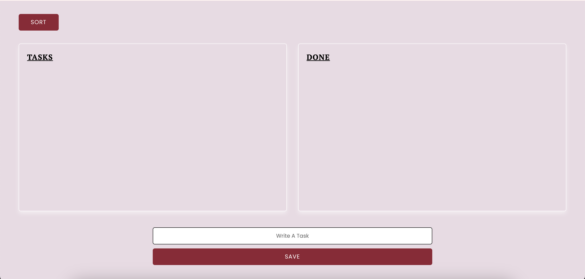
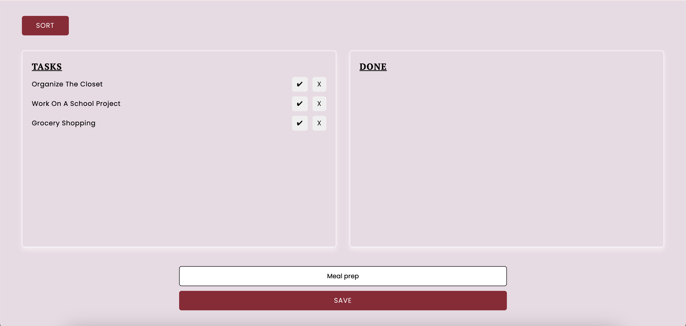
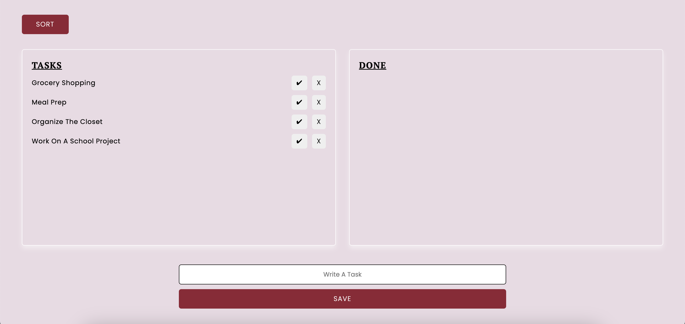
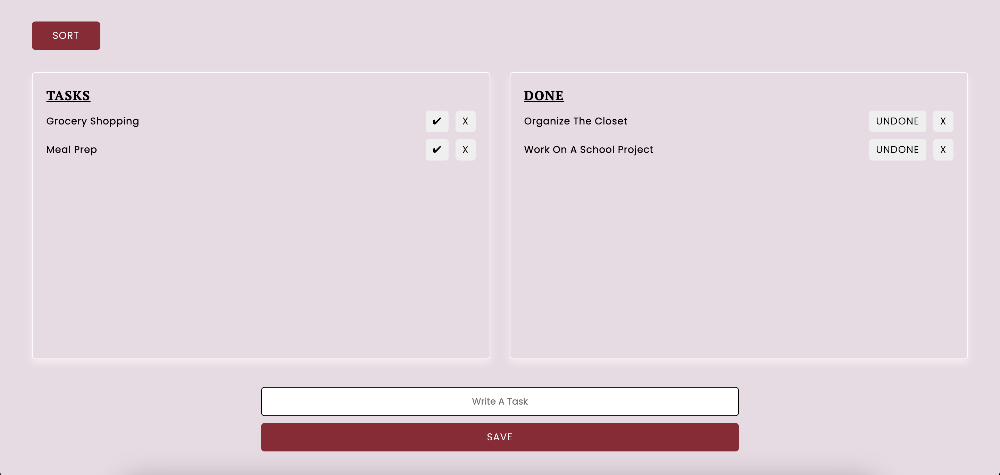
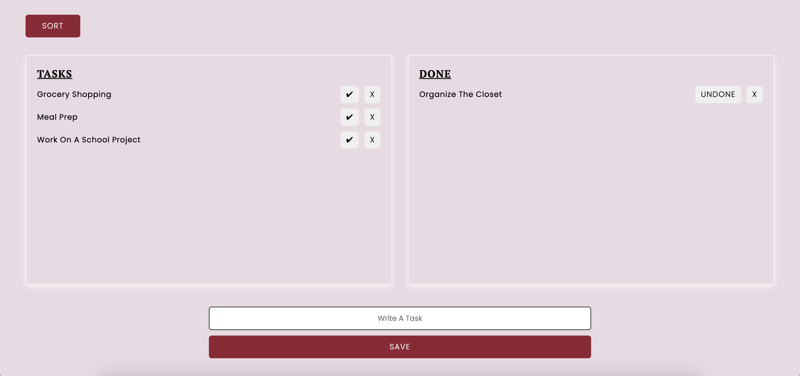
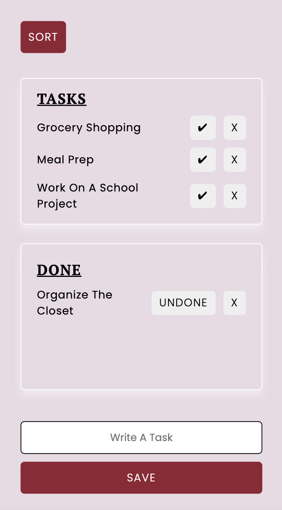
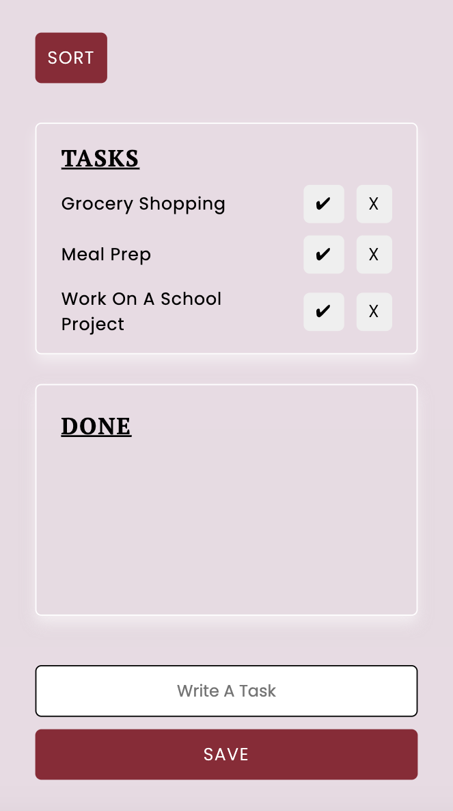

# TodoList - React 
A todo-list application built with [Vite](https://vite.dev/) and [React](https://react.dev/) using TypeScript and SCSS. 

## Features
* Add todo 
* Remove todo
* Mark as done/undone

## DEMO
### 1. Empty list 
When you first open the todo-list application, you'll see an empty tasklist and an empty donelist.
 

### 2. Add todos 
 Components -> TodoApp-tsx
 ```
export const TodoApp = () => {
    const [todos, setTodos] = useState<Todo[]>

    const addTodo = (text:string) => {
        setTodos([...todos, new Todo(Date.now(), text)]);
    };
}
```
Components -> AddTodo-tsx
```
type AddTodoProps = {
    addTodo: (t:string) => void;
}

export const AddTodo = (props: AddTodoProps) => {
    const [todoText, setTodoText] = useState("");

    return (
        <form onSubmit={handleSave}>
            <input value={todoText} placeholder="write a task" onChange={(e) => setTodoText(e.target.value)}/>
            <button>Save</button>
        </form>
    )
}
```
  

 ### 3. Sort tasks
 Components -> TodoApp-tsx
 ```
const handleSort = () => {
        if (sortOrder) {
          setTodos([
            ...todos.sort((t1, t2) => {
              if (t1.text.toLowerCase() > t2.text.toLowerCase()) return 1;
              if (t1.text.toLowerCase() < t2.text.toLowerCase()) return -1;
              return 0;
            }),
          ]);
        } else {
          setTodos([
            ...todos.sort((t1, t2) => {
              if (t1.text.toLowerCase() > t2.text.toLowerCase()) return -1;
              if (t1.text.toLowerCase() < t2.text.toLowerCase()) return 1;
              return 0;
            }),
          ]);
        }
    
        setSortOrder(!sortOrder);
      };
  ```
 

  ### 4. Mark as done/undone
  Components -> TodoApp-tsx
  ```
    const toggleTodo = (id: number) => {
          setTodos(
              todos.map((t) => {
                  if(t.id === id) {
                      return {...t, done: !t.done};
                  }
                  return t;
              })
          )
      }
  ```
  Components -> ShowTodos.tsx
  ```
  type ShowTodosProps = {
      todo: Todo[];
      toggleTodo: (i: number) => void;
  }

  return (
        <ul>
          {props.todo.map((t) => {
            return (
              <li key={t.id}>
                <button onClick={() => {
                  props.toggleTodo(t.id);
                }}>{t.done ? "Undone" : "✔"}</button>
              </li>
            )
          })}
        </ul>
    )
  ```

 
 

### 5. Remove todo
Components -> TodoApp.tsx
```
  const removeTodo = (id: number) => {
        setTodos(todos.filter((t) => t.id !== id));
    };
```
  Components -> ShowTodos.tsx
  ```
  type ShowTodosProps = {
      todo: Todo[];
      removeTodo: (i: number) => void;
  }

  return (
        <ul>
          {props.todo.map((t) => {
            return (
              <li key={t.id}>
                <button onClick={() => {
                  props.removeTodo(t.id);
                }}>X</button>
              </li>
            )
          })}
        </ul>
    )
  ```
  <p>
    
    
  </p>

<br>

## Run my todo-list application locally 
### 1. Clone this repository 
```
https://github.com/malinjansson/TodoReact.git
```

###  2. Navigate to the project folder
```
cd TodoReact
```

### 3. Install dependencies 
```
npm install
```

### 4. Run dev 
Local:   http://localhost:5173/
```
npm run dev
```

